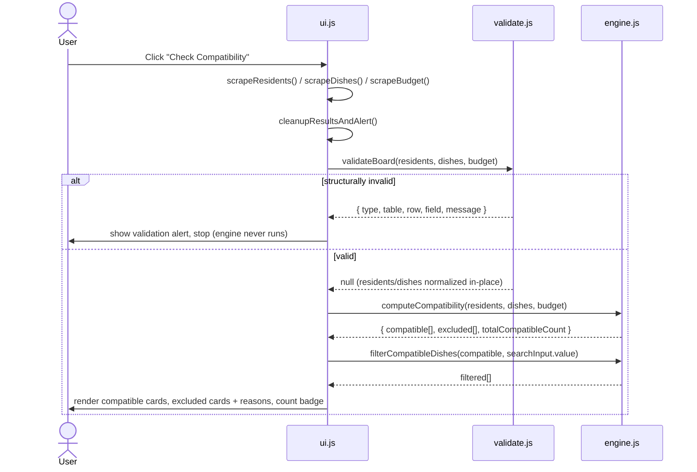
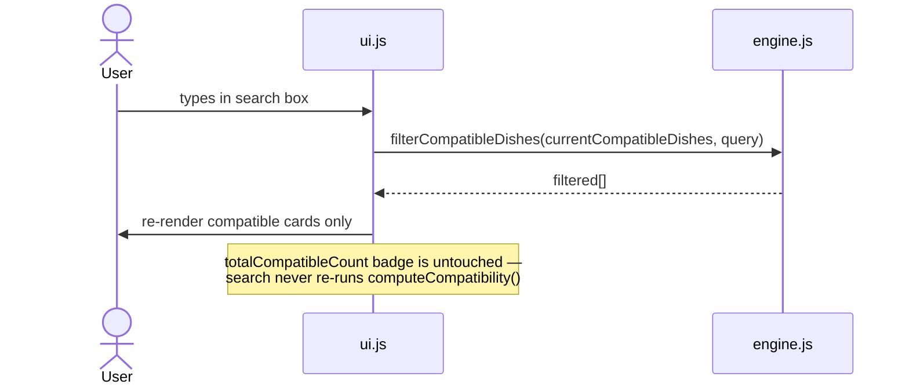
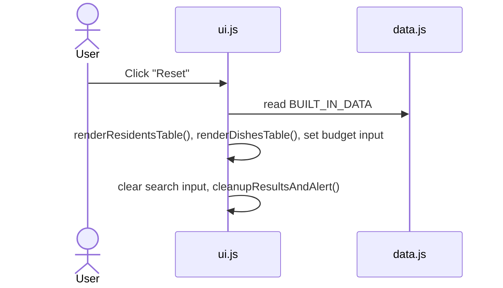

# Architecture — Hostel Food Compatibility Board

> **Problem:** `SI26_P02 — Hostel Food Compatibility Board`
> **Repo:** [darshit2308/Cisco-Project](https://github.com/darshit2308/Cisco-Project)
> **Type:** Client-side, single-page, zero-dependency web application

This document describes the system architecture: the architectural style chosen, how responsibilities are split across modules, how data flows through the system end to end, the domain contracts each layer enforces, and the trade-offs made along the way. It is meant to be read on its own — without needing to open the source first.

---

## 1. Problem Constraints That Shaped the Architecture

Three constraints from the problem statement directly drove every architectural decision below:

| Constraint | Architectural Consequence |
|---|---|
| No backend, database, or account — everything runs client-side, in memory | No API layer, no persistence layer. State lives entirely in the DOM + in-memory JS objects for the lifetime of the page. |
| Search is a secondary, incidental feature | Search is implemented as a pure display filter, decoupled from the core compatibility computation — it never re-triggers business logic. |
| Functionality over polish; must be easy to explain/modify live in an interview | A strict, linear pipeline (`Data → Validate → Engine → UI`) so a change request during the interview touches one function in one file, not a cross-cutting rewrite. |

These constraints rule out frameworks, build tools, and any client-server split — and point directly at a **layered, pipeline-style architecture** running entirely in the browser.

---

## 2. Architectural Style

The system follows a **unidirectional layered pipeline**, with a strict rule: **each layer only talks to the layer directly below it, in one direction.**

```
 ┌─────────────────────────────────────────────────────────┐
 │  Presentation Layer          ui.js                       │
 │  (the ONLY file allowed to touch the DOM)                │
 └───────────────────────────┬───────────────────────────────┘
                              │ scrapes tables → plain JS objects
                              ▼
 ┌─────────────────────────────────────────────────────────┐
 │  Validation Layer            validate.js                 │
 │  Structural checks + in-place normalization               │
 └───────────────────────────┬───────────────────────────────┘
                              │ clean, normalized, guaranteed-valid data
                              ▼
 ┌─────────────────────────────────────────────────────────┐
 │  Domain / Business Logic Layer   engine.js                │
 │  Diet rules, allergen rules, budget rule, search filter    │
 └───────────────────────────┬───────────────────────────────┘
                              │ { compatible[], excluded[], reasons }
                              ▼
                    back up to ui.js for rendering

 ┌─────────────────────────────────────────────────────────┐
 │  Static Data Layer            data.js                     │
 │  Canonical built-in sample data (residents, dishes,        │
 │  budget) — single source of truth, seeds the UI on load    │
 │  and Reset, and is imported directly by the test suite     │
 └─────────────────────────────────────────────────────────┘
```

**Why this style, specifically:**
- **Separation of concerns is enforced, not just conventional.** `engine.js` and `validate.js` contain zero DOM references — they are plain functions on plain objects. This is what makes them directly unit-testable in Node with no mocking framework.
- **One-way dependency flow.** UI depends on Validate and Engine; Engine and Validate never depend on UI. This means the business logic can be reasoned about, tested, and modified without ever touching a browser.
- **Single source of truth for data.** `data.js` is imported by both the live page (as a `<script>` global) and the Node test suite (as a `module.exports`), so the "built-in" sample data used in the app is *exactly* what the tests assert against — it cannot drift into two copies.

---

## 3. Component Breakdown

| Module | Layer | Responsibility | Touches DOM? | Runs in Node? |
|---|---|---|:---:|:---:|
| `src/js/data.js` | Data | Canonical built-in sample data: 3 residents, 5 dishes, ₹150 budget. | ❌ | ✅ |
| `src/js/validate.js` | Validation | `validateBoard()` — structural validation (types, required fields, duplicate IDs, price/budget shape) and `normalize()` — trims + uppercases strings. Mutates its arguments in place so nothing downstream has to re-normalize. | ❌ | ✅ |
| `src/js/engine.js` | Domain logic | `getExclusionReasons()`, `computeCompatibility()`, `filterCompatibleDishes()` — the actual diet/allergen/budget rules and the exact exclusion-reason ordering contract. Pure functions: same input always produces the same output, no side effects. | ❌ | ✅ |
| `src/js/ui.js` | Presentation | Scrapes the editable HTML tables into plain objects, orchestrates `validate → engine` in order, and renders the result as DOM cards/badges/alerts. The **only** file permitted to reference `document`. | ✅ | ❌ |
| `index.html` | Shell | Semantic single-screen layout: editable Residents/Dishes tables, budget input, action buttons, results panels. Loads scripts in dependency order. | — | — |
| `src/css/style.css` | Presentation | Visual design system (dark-slate theme, cards, badges, chips). No logic. | — | — |
| `tests/test_validate.js`, `tests/test_engine.js` | Verification | Zero-framework Node scripts asserting against `validate.js` / `engine.js` directly — 27 and 33 assertions respectively. | ❌ | ✅ |

### 3.1 Script Load Order (dependency order, enforced in `index.html`)

```html
<script src="src/js/data.js"></script>      <!-- 1. data first -->
<script src="src/js/validate.js"></script>  <!-- 2. validation depends on nothing -->
<script src="src/js/engine.js"></script>    <!-- 3. engine depends on nothing (trusts pre-validated data) -->
<script src="src/js/ui.js"></script>        <!-- 4. UI depends on all three globals above -->
```

---

## 4. The Dual-Environment Execution Model

The most important structural decision in this codebase: **`data.js`, `validate.js`, and `engine.js` are written to execute identically in two environments** — the browser (as global `<script>` tags) and Node.js (as `require()`-able modules) — **without ES module syntax** (no `import`/`export`), because plain `<script>` tags don't support ES modules without a build step, and this project has no build step.

Every logic file ends with the same guard:

```javascript
if (typeof module !== "undefined" && module.exports) {
  module.exports = { /* public functions */ };
}
```

```
        ┌───────────────────────┐
        │   data.js / validate.js /  │
        │        engine.js           │
        │   (single implementation)  │
        └────────────┬────────────┘
                      │
        ┌─────────────┴─────────────┐
        ▼                           ▼
 ┌───────────────┐          ┌───────────────────┐
 │   Browser      │          │   Node.js          │
 │  <script> tag  │          │  require('./x.js') │
 │  → window globals │       │  → module.exports  │
 │  (index.html)  │          │  (tests/*.js)       │
 └───────────────┘          └───────────────────┘
```

**Why this matters architecturally:** it guarantees the logic under test *is* the logic running live — there is no separate "test build" or duplicated rule-set that could silently drift from the browser version.

---

## 5. Data Flow — "Check Compatibility" (primary use case)



**Key architectural property: validation is a hard gate.** The engine is never invoked unless `validateBoard()` returns `null`. This keeps `engine.js` free of defensive type-checking and lets its logic stay focused purely on domain rules.

### 5.1 Data Flow — Live Search (secondary use case)



This confirms the constraint from §1: search is a **read-only view filter** over an already-computed result set, kept structurally incapable of affecting the compatibility count.

### 5.2 Data Flow — Reset



---

## 6. Domain Model & Contracts

### 6.1 Core Entities

```javascript
Resident = {
  name: string,               // non-empty after trim
  diet: "VEGAN" | "VEGETARIAN" | "NON_VEGETARIAN" | "NO_RESTRICTION",
  allergens: string[]         // normalized (trimmed, uppercased), "NONE" filtered out
}

Dish = {
  id: string,                 // non-empty, unique across the dish table
  cafe: string,                // non-empty
  name: string,                // non-empty
  diet: "VEGAN" | "VEGETARIAN" | "NON_VEGETARIAN",   // note: NO_RESTRICTION invalid for dishes
  tags: string[],              // non-empty array, normalized ingredient tags
  price: number                // positive whole integer
}

Budget = number                // positive whole integer, per-person
```

### 6.2 Validation Error Contract (`validate.js`)

`validateBoard(residents, dishes, budget)` fails fast — stops at the **first** invalid field — and returns either `null` (valid) or:

```javascript
{
  type: "INVALID_INPUT" | "DUPLICATE_DISH_ID",
  table: "residents" | "dishes" | "budget",
  row: number | string,   // 1-based index for residents; dish ID (e.g. "D03") for dishes; 1 for budget
  field: string,           // e.g. "name" | "diet" | "allergens" | "id" | "tags" | "price"
  message: string
}
```

Validation order is deterministic: **residents → dishes → budget**, each checked top to bottom. On success, `validateBoard` also **mutates its inputs in place** — trimming strings and uppercasing enum-like fields (`diet`, allergen tags, ingredient tags) — so `engine.js` never has to normalize anything itself.

### 6.3 Domain Rules (`engine.js`)

**Diet acceptance hierarchy** — checked per resident, per dish:

| Resident diet | Accepts dish diet |
|---|---|
| `VEGAN` | `VEGAN` only |
| `VEGETARIAN` | `VEGAN`, `VEGETARIAN` |
| `NON_VEGETARIAN` / `NO_RESTRICTION` | any |

**Allergen matching** — strict, exact string match only. No inference, no partial matches, no aliasing (`PEANUT_OIL` does **not** trigger an exclusion for an allergen of `PEANUT`).

**Budget rule** — `dish.price <= budget` passes; `price === budget` is the boundary case and **passes** (not excluded).

**Exclusion-reason ordering contract** — this is the core "hard part" of the domain, and it is enforced structurally rather than by post-hoc sorting:

1. Residents are evaluated in **resident-table order** (not alphabetical, not dish-table order).
2. For each resident: the **diet** reason (`DIET:<name>`) is emitted before any **allergen** reasons for that same resident.
3. Allergen reasons follow the **dish's own ingredient-tag order** (`ALLERGEN:<name>:<tag>`).
4. `OVER_BUDGET` is appended **strictly last**, after every resident has been checked.

```javascript
// Canonical example from the built-in dataset:
D03 → ["DIET:Asha", "ALLERGEN:Mira:MILK"]
D04 → ["ALLERGEN:Dev:PEANUT"]
D05 → ["DIET:Asha", "DIET:Dev"]
```

**Search filter** — case-insensitive substring match against `dish.cafe`, `dish.name`, or any entry in `dish.tags`; operates only over the already-compatible set.

---

## 7. Design Principles Applied

| Principle | How it shows up here |
|---|---|
| **Single Responsibility** | Each JS file has exactly one reason to change: data changes → `data.js`; a shape/format rule changes → `validate.js`; a business rule changes → `engine.js`; a rendering/interaction change → `ui.js`. |
| **Separation of pure logic from side effects** | `validate.js` and `engine.js` are pure/deterministic and DOM-free by construction — this is what makes 60 assertions possible with zero mocking. |
| **Fail fast, fail structured** | Validation returns a structured, addressable error (table/row/field) instead of throwing or returning a boolean, so the UI can point at the exact bad cell. |
| **Single source of truth** | `data.js`'s `BUILT_IN_DATA` backs the live page *and* the test fixtures — one object, not two copies that could drift. |
| **Minimal moving parts** | Zero dependencies, zero build step, zero frameworks — directly reflects the "functionality over perfection" and "simplicity" guidance in the problem statement, and keeps every layer explainable in under a minute. |

---

## 8. Testing Architecture

Because `validate.js` and `engine.js` have no DOM dependency, they are tested **directly**, as plain functions, with zero test framework and zero mocking:

```
tests/test_validate.js   → 27 assertions   (structural validation, normalization, error shape)
tests/test_engine.js     → 33 assertions   (diet/allergen/budget rules, exclusion ordering, search, budget boundary)
```

Both scripts `require()` the exact same `src/js/*.js` files that `index.html` loads as `<script>` tags (§4) — so passing tests are a direct guarantee about the shipped behavior, not a parallel re-implementation. Each test file deep-clones the built-in fixture data before mutating it, since `validateBoard()` normalizes in place (see trade-off below).

The UI layer (`ui.js`) is intentionally **not** unit-tested — it's a thin rendering layer over already-verified logic, so its correctness is checked by manual walkthrough of each interaction (scrape → validate → compute → render), not automated assertions. This mirrors the implementation plan's ordering: prove the logic first, add the DOM last, so a bug found late is visual, not a hidden correctness issue.

---

## 9. Known Trade-offs

These are deliberate, not oversights:

1. **`validateBoard()` normalizes by mutating its arguments in place**, rather than returning a normalized copy. Saves keeping two objects in sync, at the cost of not being a strictly pure function — callers (including tests) must deep-clone fixtures before validating if they need the pre-validation shape afterward.
2. **`engine.js` trusts that `validateBoard()` already ran.** It does not defensively re-normalize its own inputs. Safe through the actual UI (validation always runs first, dropdowns only emit canonical values) — but calling `computeCompatibility()` directly with raw, un-normalized data would silently produce a wrong answer. The fix (have `engine.js` call `normalize()` on its own inputs) is cheap and intentionally deferred rather than hidden.
3. **No debounce on the search input**, and the optional visual-evidence chips mentioned in the problem statement were skipped — scope was kept matched to the problem's actual size.

---

## 10. Extending the System

The layering makes the extension points explicit:

- **Add a new diet type** → update `VALID_RESIDENT_DIETS` / `VALID_DISH_DIETS` in `validate.js` → add acceptance logic in `engine.js` → add the `<option>` in `ui.js`'s table renderers → add cases to both test files.
- **Add a new exclusion rule** (e.g. a cuisine preference) → add a check inside `getExclusionReasons()` in `engine.js`, respecting the existing reason-ordering contract → add test cases to `test_engine.js`.
- **Change how results are displayed** → touch only `ui.js` / `style.css`; the data contract (`{ compatible, excluded, totalCompatibleCount }`) does not need to change.

The one rule that should never be broken: **DOM access stays isolated to `ui.js`.** Any change that would require `document` inside `engine.js` or `validate.js` is a sign it belongs in the presentation layer instead.

---

## 11. Directory Reference

```
Cisco-Project/
├── index.html                  # Layout + script load order
├── README.md                   # User-facing run instructions
├── docs/
│   ├── architecture.md         # (this file)
│   ├── design.md               # Design rationale + AI-collaboration notes
│   ├── implementation_plan.md  # Step-by-step build plan
│   └── agent.md                # Repo map & rules for AI agents making future changes
├── src/
│   ├── css/
│   │   └── style.css
│   └── js/
│       ├── data.js              # Data layer
│       ├── validate.js          # Validation layer
│       ├── engine.js            # Domain logic layer
│       └── ui.js                # Presentation layer
└── tests/
    ├── test_validate.js         # 27 assertions
    └── test_engine.js           # 33 assertions
```